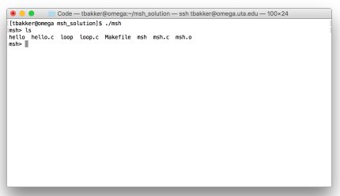
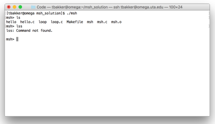
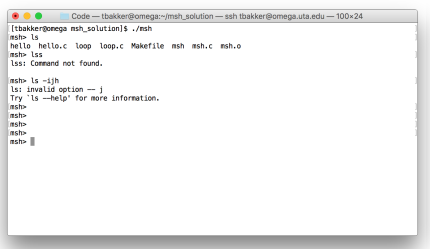
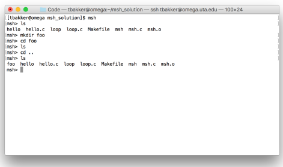
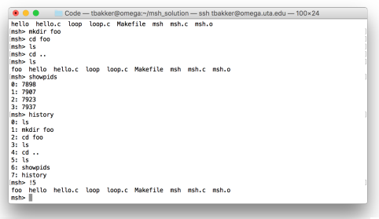

## Description
In this assignment you will write your own shell program, Mav shell (msh), similar to 
bourne shell (bash), c-shell (csh), or korn shell (ksh). It will accept commands, fork a child 
process and execute those commands. The shell, like csh or bash, will run and accept 
commands until the user exits the shell

## Requirements

1. Your program will print out a prompt of msh> when it is ready to 
accept input. It must read a line of input and, if the command given is a supported shell 
command, it shall execute the command and display the output of the command.

   #### Tests
   * make test_quit 
   * make test_exit 
   * make test_ls 
   * make test_cp

2. If the command is not supported your shell shall print the invalid 
command followed by “: Command not found.”

   #### Tests
   * \TODO test_notfound

3. After each command completes, your program shall print the msh>
prompt and accept another line of input.

   #### Tests
   * make test_ls
   * make test_cp

4. Your shell will exit with status zero if the command is “quit” or “exit”. 

   #### Tests
   * make test_quit
   * make test_exit

5. If the user types a blank line, your shell will, quietly and with no other 
output, print another prompt and accept a new line of input.

   #### Tests
   * make test_blank

6. Your version of Mav shell shall support up to 10 command line 
parameters in addition to the command. 

   #### Tests
   * make test_ls

7. Your shell shall support and execute any command entered. Any 
command in /bin, /usr/bin/, /usr/local/bin/ and the current working directory 
is to be considered valid for testing.

   #### Tests
   * make test_paths

8. Mav shell shall be implemented using fork(), wait() and one of the 
exec family of functions. Your Mav shell shall not use system(). Use of system() will result in a grade of 0.

   #### Tests
   * Inspection

9. Your shell shall support the cd command to change directories. Your 
shell must handle cd ..

   #### Tests
   * make test_cd

10. Your shell shall support the history command which will list the last 
15 commands entered by the user. Typing !n, where n is a number between 0 and 14 will 
result in your shell re-running the nth command. If the nth command does not exist then 
your shell will state “Command not in history.”. The output shall be a list of 
numbers 1 through n and their commands, each on a separate line, single spaced.

   #### Tests
   * \TODO make test_history

11. The history command shall support a -p parameter.  This will cause the history command to list the associated PID with the command.

   #### Tests
   * \TODO make test_history_pid

12. If there are less than 15 commands in the history shall only list the commands the user has
entered up to that point.

   #### Tests
   * \TODO make test_history

13. Tabs or spaces shall be used to indent the code. Your code must use 
one or the other. All indentation must be consistent.

   #### Tests
   * Inspection

14. No line of code shall exceed 100 characters. 

   #### Tests
   * Inspection

15. All code must be well commented. This means descriptive comments 
that tell the intent of the code, not just what the code is executing. 

   #### Tests
   * Inspection
   
16. Keep your curly brace placement consistent. If you place curly braces 
on a new line , always place curly braces on a new end. Don’t mix end line brace 
placement with new line brace placement. 

   #### Tests
   * Inspection
   
17. Remove all extraneous debug output before submission. The only 
output shall be the output of the commands entered or the shell prompt. 

   #### Tests
   * Inspection
   * make test
   
## Administrative

This assignment must be coded in C. Any other language will result in 0 points. You 
programs will be compiled and graded on the course GitHub Codespace. Code that does not compile 
with :
        gcc msh.c -o msh 
will result in a 0.

Your program, msh.c is to be turned in via the Feedback GitHub pull request. **Do not merge this pull request**.  Submission time is determined by 
the GitHub system time. You may push your code as often as you wish. Only your 
last submission will be graded. 

There are coding resources and working code you may use on the course GitHub page and in the assignment repository at: https://github.com/CSE3320-Spring23/Shell-Assignment. You are free to use any of that code in your program if needed. You may use no other outside code.

## Academic Integrity
This assignment must be 100% your own work. No code may be copied from friends, 
previous students, books, web pages, etc. All code submitted is automatically checked 
against a database of previous semester’s graded assignments, current student’s code 
and common web sources. By submitting your code on GitHub you are attesting that 
you have neither given nor received unauthorized assistance on this work. Code that 
is copied from an external source or used as inspiration, excluding the 
course github, will result in a 0 for the assignment and referral to 
the Office of Student Conduct.
